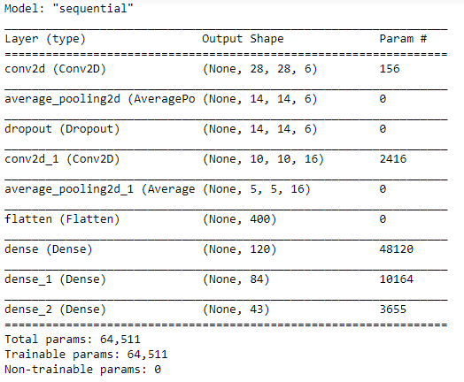
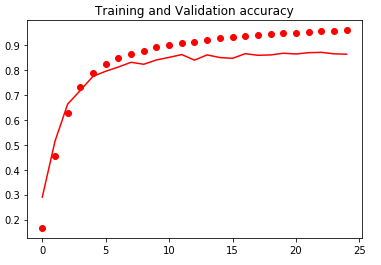
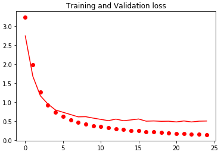
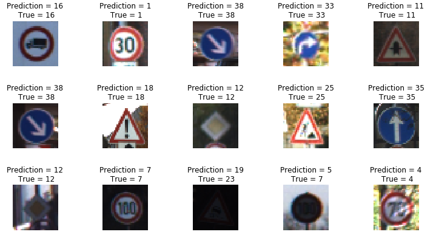

# Traffic-Sign-Classification
This Program is used to classify the Incoming Traffic Signal, it Trains the Dataset by the CNN Algorithm.
The Data set is broken into 3 Parts Test, Train and Validation. The Dataset is Given here [Traffic Signal](https://drive.google.com/drive/folders/1ddSTt211QxXKtSP_O0zs0qH_p7nv4wGq?usp=sharing).
The Accuracy of the Code is 94%.

# Screenshots

  

 This image is the output of the addition of dfferent layers in the CNN model 

  

    

 These Graph Compare the Result of the Trained model with the result of the Validation data ran on the same model, The 2 Graphs are for the Comparision of Loss and Accuracy 

# Result

  

